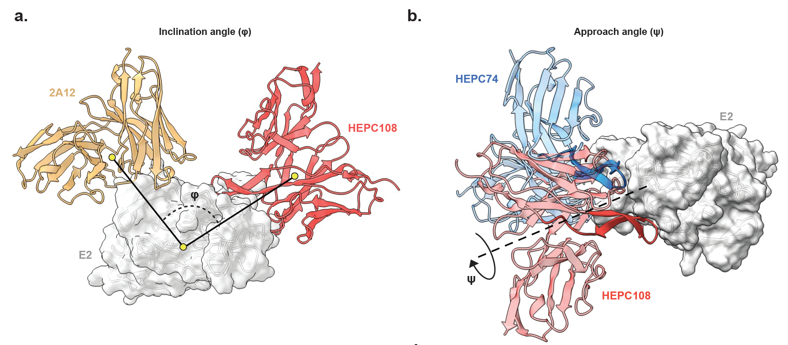

# Clustering Hepatitis C Virus (HCV) **E2-specific antibodies** by their binding orientations using two complementary geometric metrics:

- **Inclination angle (φ)** – between Fv regions of antibodies relative to the E2 center of mass.  
  → Smaller φ indicates targeting the same antigenic region (aligned orientations).  
  → Larger φ indicates distinct epitopes (different regions on E2).

- **Approach angle (ψ)** – minimal rotation required to superpose one Fab onto another.  
  → Used for FRLY antibodies to distinguish **binding modes** within the same region.

> 


## Repository Layout

```
.
├── input.csv                         # Antibody list & chain info
├── pt1_save_pdbs.ipynb               # Downloads PDB structures
├── pt2_align_E2_regions.ipynb        # Aligns structures to reference E2 (4mwf)
├── pt3_clustering.ipynb              # Computes φ and performs clustering
├── inclination_angle.csv             # Precomputed φ values
├── FRLY_Abs/
│   ├── input.csv                     # FRLY subset
│   ├── pt1_save_pdbs.ipynb
│   ├── pt2_align_E2_regions.ipynb
│   ├── pt3_clustering.ipynb          # Computes ψ and performs clustering
│   └── approach_angle.csv            # Precomputed ψ values
└── docs/
    └── figure1.png           
```

---

## 🧾 Input Format
 `input.csv`:

```
4mwf,C,H,L,AR3C(4mwf)
4web,E,H,L,2A12(4web)
6bkb,E,H,L,AR3A(6bkb)
6bkc,E,H,L,AR3B(6bkc)
6bkd,E,H,L,AR3D(6bkd)
6meh,C,H,L,HEPC74(6meh)
...
```

| Column | Description |
|--------|--------------|
| `pdb_id` | 4-letter PDB code |
| `antigen_chain` | Chain ID for E2 |
| `heavy_chain` | Heavy chain ID |
| `light_chain` | Light chain ID |
| `antibody` | Antibody name (e.g., AR3C(4mwf)) |

1. **`pt1_save_pdbs.ipynb`** – downloads all structures.  
2. **`pt2_align_E2_regions.ipynb`** – aligns on antigen chain of reference PDB **4mwf**.  
3. **`pt3_clustering.ipynb`** – computes pairwise inclination angles and clusters antibodies.

#### **FRLY Antibodies (ψ)**
Run all three notebooks inside the `FRLY_Abs/` directory.

## Precomputed Angles

- `inclination_angle.csv` – pairwise φ (all antibodies)  
- `FRLY_Abs/approach_angle.csv` – pairwise ψ (FRLY subset)


##  Contact

For questions or inquiries:  
📧 **rjtpunia@cornell.edu**

---

## Acknowledgements

PDB structures from **RCSB PDB**.  
